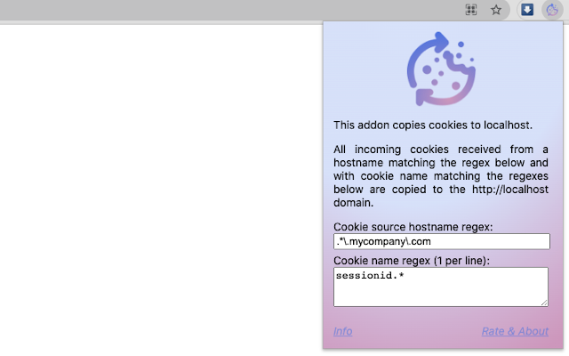

# CookieSync

This is an add-on which copies cookies to localhost.

This addon monitors all incoming cookies from a user defined hostname regex and matching a user defined cookie name regex to copy them to the http://localhost domain.

It's primary here for developers that have code running on their localhost which connects to other services and need access to their cookies. The typical use case is a third-party login flow. In production the developer's code wil run on the same domain as the other services and have access to the cookies they set.
But when code is running on localhost (during development), those cookies are not accessible in the browser. This add on makes those cookies available on localhost, so available to the developer's local code.

Screenshot:

*Firefox*

*Chrome*

# Compatibility
- Firefox
- Chrome

# Plugin development notes

This is relevant when changes are needed to the plugin.

## Firefox 

### Run from files
You can let firefox use the addon directly from the files in this folder, instead of via the store. 
Go to about:debugging#/runtime/this-firefox in a Firefox tab. Choose 'Load Temporary Add-on...' and select the manifest.json here.
An addon can log using console.log() statements. 
To get a view on these: Menu > Tools > Browser Tools > Browser Console.  Make sure that 'Show Content Messages' is checked in the top right settings popup menu.

### Packaging
Repackage the addon in firefox folder via :

zip -r -FS CookieSync.zip background.js icon* manifest.json popup*

## Chrome
You can let Chrome run the extension directly from the files in this folder, instead of via the store.
Go to chrome://extensions.  Enable developer mode toggle switch. Click 'Load unpacked' button and choose chrome folder
Click on the blue background page link to open console log window.
Click the reload button when making changes.

### Packaging
Repackage the extension in chrome folder via :

zip -r -FS CookieSync.zip background.js icon* manifest.json popup*
